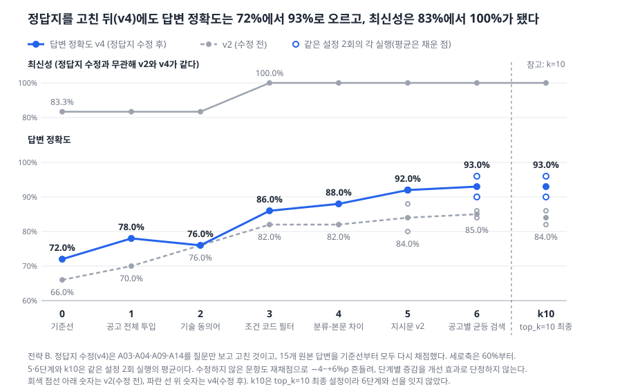
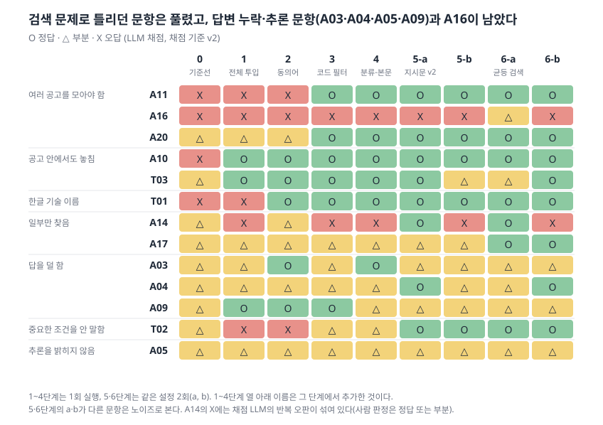
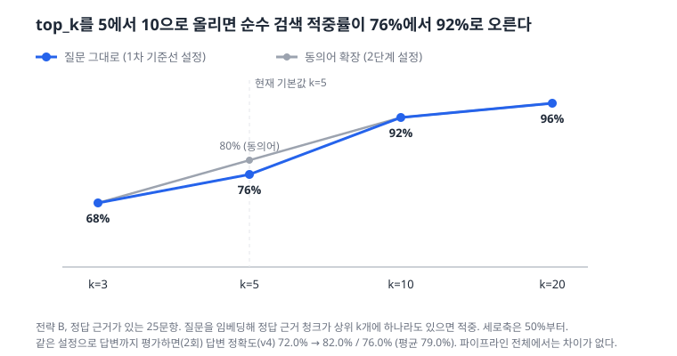

# 6단계 개선 현황과 실험 로그

작성일 2026-10-06, 갱신 2026-10-07(7단계 현황·누적 비용 반영). 단계별 상세 설명은 `docs/step6_experiments.md`, 실행마다의 지표는 `eval/results/summary.csv`, 비용은 `eval/usage_log.csv`에 있다. 이 문서는 그것들을 한 장으로 모은 것이다. 모든 수치는 전략 B, top-5, 답변·채점 gpt-6-luna, 평가 기준일 2026-10-02, 채점 기준 v2다.

## 1. 현황

| 단계 | 상태 | 산출물 |
|---|---|---|
| 1~4 주제·데이터·청킹·평가셋 | 완료 | 평가셋 30문항, `src/run_eval.py`, 1차 기준선(전략 B 답변 정확도 66%) |
| 5 오답노트 | 완료 | `docs/step5_error_notes.md` (틀린 13문항을 검색 실패 8·생성 왜곡 5로 분류, 점수 손실의 71%가 검색 실패) |
| 6 개선 | **진행 중** | 이 문서, `docs/step6_experiments.md`, 보고서(Claude Docs) |
| 7 서비스화 | **진행 중** | `docs/step7_service.md` (엔진·로그 DB·Streamlit 화면 완료, 서비스용 재수집·색인 남음) |
| 8 최종 리포트 | 시작 전 | |

6단계에서 `CLAUDE.md`가 요구하는 항목의 진행 상태

| 항목 | 상태 | 비고 |
|---|---|---|
| 프롬프트 교체 | 완료 | 5단계(지시문 v2) |
| 반복 테스트 | 완료 | 5·6단계는 같은 설정 2회. 1~4단계는 1회 |
| 청킹 교체 | 부분 | 전략 A·B 비교는 1차 기준선에서만 했고 이후는 전략 B 고정 |
| top_k | 완료 | 5 vs 10 (검색 단독, 순수 검색 설정 2회, 6단계 파이프라인 2회) |
| 모델 변경 | 안 함 | 답변·채점 모두 gpt-6-luna |
| 임베딩 교체 | 안 함 | text-embedding-3-small 고정 |
| 실험 로그 | 이 문서 | |
| 그래프 | 완료 | `docs/figures/`에 SVG 3개(단계별 점수 v2→v4, 오답노트 13문항 판정(v4), top_k별 검색 적중률). 생성 스크립트 `src/make_figures.py` |

핵심 결과: 답변 정확도 66.0% → 84~86%(6단계, 2회 평균 85.0%), 최신성 83.3% → 100%, 검색 적중률 73.3% → 100%(조건 필터 문항을 뺀 7문항 기준). 누적 API 비용 $0.585(`eval/usage_log.csv` 2026-10-07 17:30 기준. 평가·실험 $0.427 + 7단계 엔진 점검 $0.085 + 정답지 수정(v4) 재채점 $0.073. 앱 질문 로그 $0.017은 별도). 위의 66% → 84~86%는 정답지 수정 전(v2) 수치이고, 수정 후(v4) 수치는 아래 3절과 `eval/README.md`의 "정답지 수정(v4) 재채점 결과"에 있다.

## 2. 실험 로그

판정: 채택 = 쓰기로 함 / 수정 = 부작용·한계를 찾아 설계를 고침 / 기각 = 쓰지 않기로 함 / 되돌림 = 일단 넣었다가 뺌 / 참고 = 비교용 측정

| # | 바꾼 것 | 전 → 후 | 판정 | 이유 | 비용 | 커밋 |
|---|---|---|---|---|---|---|
| 0-a | 청킹 전략 A → B (긴 항목을 나눠 자름) | 답변 정확도 A 64% → B 66% (채점 v2. 채점 v1에서도 62% → 64%), 검색 적중률은 76%로 같음 | 채택 (B) | 긴 청크는 관계없는 내용이 섞여 검색이 흐려짐. 정확도 차이는 작아 판단은 보류하고 B로 고정 | $0.01 | `98a8566` |
| 0-b | 채점 기준 v1 → v2 (필수 요소 수정, 근거 표시를 공고ID+항목으로 비교) | 사람 일치율 90% → 100%, 근거 표시 정확도 84% → 74% | 채택 | 필수 요소 3개가 사람 판단과 달랐고, 틀린 답에도 "근거 표시 정답"이 붙던 오류가 있었음 | $0.009 | `70e8cd5` |
| 0-c | 문서 없이 답하게 한 빈손 테스트 | 답변 정확도 6%, 최신성 0%, 문서에 없음 처리 60% | 참고 | 공고 근거가 점수를 만든다는 증거(RAG의 효과) | $0.005 | `ca80501` |
| 1 | 공고 선택 시 그 공고 전체를 근거로 투입 | 답변 정확도 66.0% → 70.0%, 근거 표시 74.0% → 80.0% | 채택 | 같은 공고 안에서도 정답 항목(채용절차 등)이 top-5에서 밀리던 문제 해소 (A09·A10·T03 개선) | $0.016 | `324c835` |
| 2 | 기술 동의어 사전으로 검색 질문 확장 | 답변 정확도 70.0% → 76.0%, 검색 적중률 11/15 → 12/15 | 채택 | 한글 "스프링"과 영문 "Spring"이 연결되어 T01 해결 | $0.016 | `6a7613b` |
| 2-b | 동의어 한글 일치 규칙 보정 | 확장 문항 변화 없음(재측정 안 함) | 수정 | 회사명 "인공지능팩토리"가 AI 그룹에 오탐됨. 한글은 2자 이상이고 뒤가 한글이 아니거나 조사일 때만 일치 | $0 | `6a7613b` |
| 3 | 학력·재택·마감일·기술을 공고별 칸으로 뽑아 코드로 필터, LLM은 설명만 | 답변 정확도 76.0% → 82.0%(사람 반영 86.0%), **최신성 83.3% → 100%**, 필터 정밀도·재현율 100% | 채택 | 임베딩으로 못 찾던 조건 검색(A11·A20 등)을 코드가 정확히 처리 | $0.049 | `727cfbf` |
| 4-v1 | 점핏 분류와 본문이 다르면 답변에 항상 명시 | 답변 정확도 82.0% 그대로, 근거 표시 94.0% → 92.0%, 불일치 4건 탐지 | 수정 | 질문과 무관한 A08·A11·A14에도 경력 문장이 붙어 A14가 부분으로 떨어짐 | $0.042 (4단계 전체) | `5e4ab38` |
| 4-v2 | 질문이 경력·신입을 물을 때만 명시 | 근거 표시 92.0% → 94.0%, 답변 정확도 82.0%(사람 반영 86.0%) | 채택 | 부작용 해소. 점수 변화는 없지만 점핏 분류만 믿는 단정을 막음 | | `5e4ab38` |
| 5 | 답변 지시문 v2 (항목 누락 방지, 지원 가능 여부는 결론부터, 필수·우대 구분은 기술 조건만) | 답변 정확도 82.0% → 88.0% / 80.0%(2회, 평균 84.0%), T02 부분 → 정답(2회 모두) | 채택 | 효과가 확인된 것은 T02 하나이고 평균 상승은 노이즈 범위. 답변이 길어짐(193 → 241자). "문서에 없음" 기준은 한 번 채점 노이즈로 미충족 | $0.037 | `8b1d707` |
| 6-초안 | 공고별 균등 검색: 공고당 질문과 가까운 청크 2개 | A16 정답 근거 검색 0/4 | 수정 | 임베딩 순위가 개요·복지·채용절차를 먼저 올려 자격요건 청크를 못 가져옴 | $0.0025 | `53ff404` |
| 6 | 공고별 균등 검색: 질문에서 항목을 찾아 공고마다 그 항목 청크 + 개요 | 답변 정확도 84.0% / 86.0%(2회, 평균 85.0%), 검색 적중률 85.7% → 100%, A17 부분 → 정답(2회 모두), A16 검색 0/4 → 4/4 | 채택 | A17은 일관되게 개선. A16은 검색은 풀렸지만 서버 공고만 골라 종합하지 못함(직무 분류 문제). 항목 찾는 낱말 규칙은 평가 문항을 본 뒤 만들었음 | $0.044 | `53ff404` |
| 7-a | top_k 5 → 10, 검색 단독 비교 (25문항, LLM 호출 없음) | 검색 적중률 76.0% → 92.0% (k=3 68%, k=20 96%), 근거 재현율 69.3% → 85.6% | 채택 | 정답 근거 청크가 top-5 밖이던 문항이 k=10에서 들어옴. LLM 없이 결정되는 값이라 노이즈 없음 | $0.00002 | |
| 7-b | top_k 5 → 10, 순수 검색 설정 전체 평가 (2회) | 답변 정확도 66.0% → 78.0% / 68.0%(평균 73.0%), 근거 표시 74.0% → 86.0%, A10·T01·T03 두 번 모두 개선, 나빠진 문항 없음 | 채택 | 1·2단계가 고친 문항(공고 안 항목 누락, 한글 기술명)을 k만 키워도 상당 부분 해결. 비용 같은 수준. k=5 기준선이 1회뿐이라 평균 상승은 노이즈를 배제하지 못함 | $0.032 | |
| 7-c | top_k 5 → 10, 6단계 최종 파이프라인 (2회) | 답변 정확도 84.0% / 86.0% → 82.0% / 86.0%, 근거 표시 94% → 96%, 확실히 달라진 문항 없음 | 차이 없음 (서비스 기본값 k=10 권장) | 검색에 의존하는 7문항이 k=5에서 이미 적중률 100%. 서비스에서는 필터·공고 선택이 아닌 질문이 검색으로 처리되므로 7-b 결과를 근거로 k=10을 권장 | $0.040 | |
| 기준-A14 | A14 채점 메모에 "경력 공고" 정의 추가 (채점 기준 v2.1) | 기준선 66% → 66%(변화 없음), 이후 단계에서 A14 정답 판정 | 되돌림 | 사용자 요청으로 강사님 검토 전까지 보류. 채점 LLM이 정답 공고를 경력 공고로 세 번 오판한 것이 이유였음 | $0.092(아래 기준-A04·A05와 합산) | `0812bd3` → `be46355` |
| 기준-A04·A05 | A04 스톡옵션 필수 요소 제외, A05 추론 구분 선택화 (채점 기준 v3) | 기준선 66% → 70% (기준 완화 효과) | 기각 | 결과를 본 뒤 점수가 오르는 방향으로 기준을 바꾸는 것이고, A05는 추론 구분을 재는 유일한 문항이라 능력을 재지 못하게 됨. 두 문항은 평가 기준이 아니라 지시문(5단계)으로 다루기로 함 | | `0812bd3` → `be46355` |
| 기준-v4 | 정답지 수정(질문만 보고): A03 시스템 프로그래밍 제외, A04 스톡옵션 제외, A09 원문 표현으로 정정, A14 "섞이면 안 되는 내용"을 경력 공고ID로 구체화. 기준선부터 15개 원본 답변을 모두 재채점 | 답변 정확도 기준선 B 66.0% → 72.0%(A 64.0% → 70.0%), 5단계 88.0%/80.0% → 92.0%/92.0%, 6단계 84.0%/86.0% → 96.0%/90.0%. 최신성·근거 표시 정확도 변화 없음 | 채택 | 강사님 피드백(정답지는 질문만 보고 고치고, 고치면 처음 버전부터 전부 재채점, 전·후 점수 표기). 변화 중 수정 4문항의 몫은 +2~10%p이고, 수정하지 않은 문항도 재채점 변동으로 −4~+6%p 바뀌어 단계별 증감을 개선 효과로 단정하지 않는다 | $0.073 | |
| 도구-비용 | 토큰 합산 오류 수정 | 이전 평가 비용이 채점분만 기록됨, 추정 보정 합계 $0.070 | 수정 | 답변·채점 모델이 같아 토큰이 덮어써짐 | | `727cfbf` |
| 도구-노이즈 | 같은 설정을 2회 실행해 노이즈 크기 측정 | 5단계 a·b가 88.0% / 80.0%(8%p 차이) | 채택 | 한 번의 점수 상승이 개선인지 우연인지 가리려고 5단계부터 두 번 돌리고 두 번 모두 나아진 문항만 개선으로 셈 | | `8b1d707` |

## 3. 단계별 수치 (한눈에)

이 절의 표는 정답지를 고치기 전(채점 기준 v2) 수치다. 정답지 수정(v4) 뒤의 전·후 비교는 `eval/README.md`의 "정답지 수정(v4) 재채점 결과"에 있다. 그래프(`docs/figures/`)는 v4 기준으로 다시 그렸다(아래 "그래프" 참고).

| 단계 | 답변 정확도 | 최신성 | 출처 정확도 | 근거 표시 정확도 | 검색 적중률 | 문서에 없음 |
|---|---|---|---|---|---|---|
| 0 기준선 | 66.0% | 83.3% | 100% | 74.0% | 73.3% (11/15) | 100% |
| 1 | 70.0% | 83.3% | 100% | 80.0% | 73.3% (11/15) | 100% |
| 2 | 76.0% | 83.3% | 100% | 82.0% | 80.0% (12/15) | 100% |
| 3 | 82.0% (사람 86.0%) | 100% | 100% | 94.0% | 85.7% (6/7) ※ | 100% |
| 4 (4-v2) | 82.0% (사람 86.0%) | 100% | 98.8% | 94.0% | 85.7% (6/7) ※ | 100% |
| 5-a / 5-b | 88.0% / 80.0% | 100% | 100% | 94.0% | 85.7% (6/7) ※ | 80.0% / 100% |
| 6-a / 6-b | 84.0% / 86.0% | 100% | 100% | 94.0% | 100% (7/7) ※ | 80.0% / 100% |

※ 3단계부터 조건 필터를 쓰는 8문항은 검색 적중률 집계에서 뺐다(분모 7문항). 1단계 이전의 11/15는 공고 선택 10문항을 뺀 15문항 기준이다. 자세한 설명은 `docs/step6_experiments.md`.

### 정답지 수정(v4) 기준 전체 지표

정답지를 질문만 보고 고친 뒤(A03, A04, A09, A14) 같은 답변을 처음 버전부터 다시 채점한 값이다(2026-10-07, 채점 기준 v4). 답변 정확도와 문서에 없음은 v2 → v4를 같이 적었고, 최신성·출처 정확도·근거 표시 정확도·검색 적중률은 정답지 수정과 무관해 v2와 같다. 수정 전 정답지는 `eval/eval_set_v2.csv`, 실행별 변화의 분해(수정한 문항의 몫과 재채점 변동)는 `eval/README.md`의 "정답지 수정(v4) 재채점 결과", 수정한 이유는 `docs/grading_review_questions.md`에 있다.

| 실행 | 답변 정확도 v2 → **v4** | 최신성 | 출처 정확도 | 근거 표시 | 검색 적중 | 문서에 없음 v2 → v4 |
|---|---|---|---|---|---|---|
| 0 기준선 (A) | 64.0 → **70.0** | 83.3% | 100% (62/62) | 74.0% | 76.0% (19/25) ※ | 100% → 100% |
| 0 기준선 (B) | 66.0 → **72.0** | 83.3% | 100% (69/69) | 74.0% | 76.0% (19/25) ※ | 100% → 100% |
| 1 공고 전체 투입 | 70.0 → **78.0** | 83.3% | 100% (64/64) | 80.0% | 73.3% (11/15) | 100% → 100% |
| 2 기술 동의어 | 76.0 → **76.0** | 83.3% | 100% (66/66) | 82.0% | 80.0% (12/15) | 100% → 100% |
| 3 조건 코드 필터 | 82.0 → **86.0** | 100% | 100% (93/93) | 94.0% | 85.7% (6/7) | 100% → 100% |
| 4-v1 분류-본문 | 82.0 → **88.0** | 100% | 99.0% (97/98) | 92.0% | 85.7% (6/7) | 100% → 100% |
| 4-v2 | 82.0 → **88.0** | 100% | 98.8% (85/86) | 94.0% | 85.7% (6/7) | 100% → 100% |
| 5-a 지시문 v2 | 88.0 → **92.0** | 100% | 100% (145/145) | 94.0% | 85.7% (6/7) | 80% → 100% |
| 5-b | 80.0 → **92.0** | 100% | 100% (122/122) | 94.0% | 85.7% (6/7) | 100% → 100% |
| 6-a 공고별 균등 검색 | 84.0 → **96.0** | 100% | 100% (118/118) | 94.0% | 100% (7/7) | 80% → 100% |
| 6-b | 86.0 → **90.0** | 100% | 100% (133/133) | 94.0% | 100% (7/7) | 100% → 100% |
| top_k=10 순수 검색 a | 78.0 → **82.0** | 83.3% | 100% (70/70) | 86.0% | 92.0% (23/25) ※ | 100% → 100% |
| top_k=10 순수 검색 b | 68.0 → **76.0** | 83.3% | 100% (70/70) | 86.0% | 92.0% (23/25) ※ | 100% → 80% |
| top_k=10 최종 a | 82.0 → **90.0** | 100% | 100% (120/120) | 96.0% | 100% (7/7) | 100% → 100% |
| top_k=10 최종 b | 86.0 → **96.0** | 100% | 100% (112/112) | 96.0% | 100% (7/7) | 100% → 100% |

※ 검색 적중 분모는 위 표와 같은 규칙이다. 기준선과 top_k=10 순수 검색은 25문항 기준이고, 기준선을 공고 선택 10문항을 뺀 15문항으로 보면 73.3%(11/15)로 위 표와 같다.

- v4 기준 흐름: 기준선 B 72.0% → 5단계 92.0% / 92.0% → 6단계 96.0% / 90.0%(평균 93.0%), 최신성 83.3% → 100%. 수정 전(v2)의 66.0% → 84~86%와 비교하면 시작점이 6%p(66.0% → 72.0%), 끝점이 평균 8%p(85.0% → 93.0%) 올랐고 개선 폭(+19%p → +21%p)은 비슷하다.
- 같은 답변을 같은 정답지로 다시 채점해도 수정하지 않은 문항이 −4~+6%p 바뀌었으므로(재채점 LLM 변동), 실행 하나의 변화를 개선 효과로 단정하지 않는다. 문서에 없음의 80% ↔ 100% 변동(5-a, 6-a, top_k=10 순수 b)도 정답지를 고치지 않은 N01·N02의 변동이다.
- 그래프(`docs/figures/`)는 v4 기준으로 다시 그렸다. 단계별 점수 그래프는 v2(점선)와 v4(실선)를 같이 그리고 top_k=10 최종 두 실행을 참고로 붙였다. 히트맵은 v4 판정이고 정답지를 고친 문항(A03·A04·A09·A14)에 ※를 달았다. top_k별 검색 적중률은 정답지 수정과 무관해 그대로이고 각주의 답변 정확도만 v4 값으로 바꿨다.

### 그래프

## 4. 측정에서 알게 된 것

- **노이즈**: 설정이 같아도 답변 정확도가 8%p까지 달랐다. 문항 하나(2~4%p) 차이는 개선으로 단정하지 않는다.
- **채점 LLM 오판**: A14는 정답 6곳이 모두 있어도 반복해서 "경력 공고 섞임"으로 오답 처리됐다. "문서에 없음" 문항에서는 마감일·상태 줄을 덧붙였다고 오답 처리하는 노이즈가 5단계 a(N02), 6단계 a(N01)에서 나왔다.
- **효과가 확인된 문항은 많지 않다**: 3단계(A11·A12·A20), T02, A17, T01, A10·T03 정도다. 나머지 단계 점수 변화는 노이즈 범위가 섞여 있다.

## 5. 아직 남은 것

| 구분 | 내용 |
|---|---|
| 6단계 미실시 | 모델 변경, 임베딩 교체(재색인), 청킹 추가 비교 |
| 틀리는 문항 | 정답지 수정(v4) 기준 6단계에서 남은 건 두 문항이다. A16(서버 개발 공고만 골라 종합 → 오답노트 7단계: 직무 분류와 본문 차이, 부분/오답), A05(추론했다는 사실을 밝히지 않음, 부분/부분). A03·A04·A09·A14는 정답지를 고쳐서 풀렸고(모델 개선 효과 아님), A17은 6단계에서 풀렸다. T03은 한 실행(b)만 부분이라 노이즈로 본다 |
| 7단계 | 서비스용 데이터 재수집·색인, 공고별 칸 추출, 앱 전환 (`docs/step7_service.md`) |
| 8단계 | 최종 리포트 |

## 6. 산출물 위치

| 종류 | 위치 |
|---|---|
| 코드 | `src/run_eval.py`(평가·개선 옵션), `src/extract_fields.py`(공고별 칸 추출), `src/topk_retrieval.py`(top_k별 검색 적중률), `src/make_figures.py`(그래프), `data/tech_synonyms.json`, `data/posting_fields_eval.csv` |
| 문서 | `docs/step5_error_notes.md`, `docs/step6_experiments.md`, 이 문서, `eval/README.md` |
| 결과·비용 | `eval/results/`, `eval/results/summary.csv`, `eval/usage_log.csv` |
| 그래프 | `docs/figures/stage_scores.svg`, `item_heatmap.svg`, `top_k_retrieval.svg` |
| 보고서 | Claude Docs "피드백 반영 개선 실험 결과" (0~4단계 그래프 포함) |
